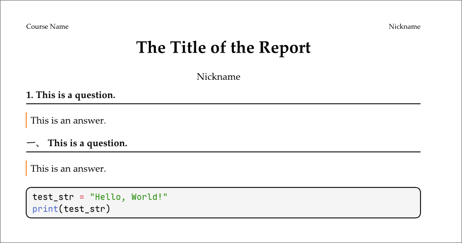

# Typwork-some
个人写作的Typst预设  
Typst presets for my work writing.  

## 项目来源 
本项目基于 [typreset](https://github.com/Fr4nk1inCs/typreset) 修改，感谢原作者的贡献。  
This project is modified from [typreset](https://github.com/Fr4nk1inCs/typreset). Thanks to the original author for their contribution.

## 使用方法

### 下载

手动下载 Scripst 并将其存放至：  
```
~/.local/share/typst/packages/local/typwork-some/0.1.0                 # Linux  
%APPDATA%\typst\packages\local\typwork-some\0.1.0                      # Windows  
~/Library/Application Support/typst/packages/local/typwork-some/0.1.0  # macOS  
```

或者运行如下命令：

```bash 
mkdir -p {data-dir}/typst/packages/local/typwork-some
git clone https://github.com/yeelysia/typwork-some.git ~/.local/share/typst/packages/local/typwork-some/0.1.0
```

其中`data-dir`为Typst的数据目录，如上述Linux系统中的`~/.local/share/typst`，Windows系统中的`%APPDATA%\typst`，macOS系统中的`~/Library/Application Support/typst`。

### 使用
```typst
#import "@local/typwork-some:0.1.0": homework

#let question = homework.question
#let answer = homework.answer

#let level = sys.inputs.at("level", default: "post"); //报告等级 the level of the report

/*
  level: "post" | "submit"
  post: 显示昵称并隐藏学号 show nickname and hide student ID
  submit: 显示真名和学号 show real name and student ID
*/

#show: homework.style.with(
  course: "Course Name",
  name: "Student Name",
  alter: "Nickname",
  id: "Student ID",
  lang: "zh-cn", // "zh-cn" | "en"
  title: "The Title of the Report",
  level: level,
)

#question(number:1)[
  This is a question.
]
#answer()[
  This is an answer.
]
#question(number:"一、")[
  This is a question.
]
#answer()[
  This is an answer.
]
```
